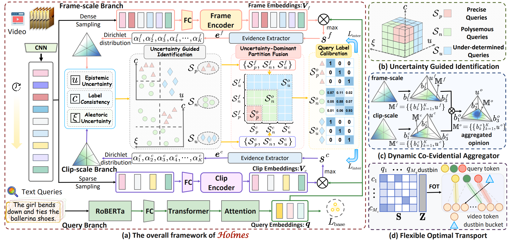

# Revisiting Uncertainty: On Evidential Learning for Partially Relevant Video Retrieval


**:star: If **Holmes** is helpful to your  projects, please help star this repo. Thanks! :hugs:**

**We sincerely invite readers to refer to our previous works: [ICCV25-HLFormer](https://github.com/lijun2005/ICCV25-HLFormer) and [CVPR26-DreamPRVR](https://github.com/lijun2005/CVPR26-DreamPRVR), as well as our curated [Awesome-PRVR](https://github.com/lijun2005/Awesome-Partially-Relevant-Video-Retrieval).**

## TABLE OF CONTENTS
- [Revisiting Uncertainty: On Evidential Learning for Partially Relevant Video Retrieval](#revisiting-uncertainty-on-evidential-learning-for-partially-relevant-video-retrieval)
  - [TABLE OF CONTENTS](#table-of-contents)
  - [1. Introduction](#1-introduction)
  - [2. Preparation](#2-preparation)
    - [2.1 Requirements](#21-requirements)
    - [2.2 Download the  datasets](#22-download-the--datasets)
  - [3. Run](#3-run)
    - [3.1 Train](#31-train)
    - [3.2 Retrieval Performance](#32-retrieval-performance)
  - [4. References](#4-references)
  - [5. Acknowledgements](#5-acknowledgements)
  - [6. Contact](#6-contact)

## 1. Introduction
This repository contain the  implementation of our work at **ICML 2026**:

> [**Revisiting Uncertainty: On Evidential Learning for Partially Relevant Video Retrieval**](https://arxiv.org/abs/2605.06083) Jun Li, Peifeng Lai, Xuhang Lou, [Jinpeng Wang](https://github.com/gimpong), Yuting Wang, Ke Chen, Yaowei Wang, Shu-Tao Xia.



We propose **Holmes**, a hierarchical evidential learning framework that aggregates multi-granular cross-modal evidence to quantify and model uncertainty explicitly:
(i) At the inter-video level, similarity scores are interpreted as evidential support and modeled via a Dirichlet distribution. Based on the proposed three-fold principle, we perform fine-grained query identification, which then guides query-adaptive calibrated learning.
(ii) At the intra-video level, to accumulate denser evidence, we formulate a soft query-clip alignment via flexible optimal transport with an adaptive dustbin, which alleviates sparse temporal supervision while suppressing spurious local responses.
## 2. Preparation

```bash
git clone https://github.com/lijun2005/ICML26-Holmes.git
cd ICML26-Holmes/
```

### 2.1 Requirements
We train Charades-STA on Nvidia 3080 Ti with the environment:
- python==3.11.8
- pytorch==2.0.1

We train TVR, ActivityNet Captions on Nvidia A100-40G with the environment:
- python==3.9.17
- pytorch==2.0.1


### 2.2 Download the  datasets
All features  can be downloaded from [Baidu pan](https://pan.baidu.com/s/1UNu67hXCbA6ZRnFVPVyJOA?pwd=8bh4) or [Google drive](https://drive.google.com/drive/folders/11dRUeXmsWU25VMVmeuHc9nffzmZhPJEj?usp=sharing) (thanks to [ms-sl](https://github.com/HuiGuanLab/ms-sl)). 

**!!! Please note that we did not use any features derived from ViT.**

The dataset directory is organized as follows:
```bash
Holmes/
    ├── activitynet/
    │   ├── FeatureData/
    │   ├── TextData/
    │   ├── val_1.json
    │   └── val_2.json
    ├── charades/
    │   ├── FeatureData/
    │   └── TextData/
    └── tvr/
        ├── FeatureData/
        └── TextData/
```
We convert the `feature.bin`  into  `feature.hdf5` . Please refer to `src/Utils/convert_hdf5.py` (thanks to [FAWL](https://github.com/BUAAPY/FAWL)).

Finally, set root and data_root in config files (*e.g.*, ./src/Configs/tvr.py `cfg['root']` and `cfg['data_root']`).

## 3. Run
### 3.1 Train 
To train Holmes on ActivityNet Captions:
```
cd src
python main.py -d act --gpu 0
```

To train Holmes on Charades-STA:
```
cd src
python main.py -d cha --gpu 0
```

To train Holmes on TVR:
```
cd src
python main.py -d tvr --gpu 0
```

Following [RAL](https://github.com/zhanglong-ustc/RAL-PRVR), we also employ a dual-query branch to achieve better performance.

To train Holmes on TVR with the dual-query branch:
```
cd multisrc
python main.py -d tvr --gpu 0
```
### 3.2 Retrieval Performance
For this repository, the expected performance is:

| *Dataset* | *R@1* | *R@5* | *R@10* | *R@100* | *SumR* | *Log* |*Ckpt*|
| ---- | ---- | ---- | ---- | ---- | ---- |---- |---- |
| ActivityNet Captions | 9.3 | 27.8 | 40.5 | 79.1 | 156.8 |[act-log](logs/act-log.txt) |[act-ckpt](https://drive.google.com/file/d/1nNiGnyLLMMoeYeohp9JEcshVJyTWntLi/view?usp=sharing)|
| Charades-STA | 2.3 | 9.5 | 15.2 | 53.6 | 80.6 |[cha-log](logs/cha-log.txt) |[cha-ckpt](https://drive.google.com/file/d/1qLLNnPx1WiEhQhjBrm9af4YgyDqjPCNg/view?usp=sharing)|
| TVR | 17.3 | 39.0 | 50.4 | 87.4 | 194.2 |[tvr-log](logs/tvr-log.txt) |[tvr-ckpt](https://drive.google.com/file/d/1Zzw9l82enS2DHjMaS7ow_CaOhq5Ht1Fm/view?usp=sharing)|
| TVR (multi) | 18.4 | 40.7 | 52.0 | 87.5 | 198.6 |[multi-tvr-log](logs/multi-tvr-log.txt) |[multi-tvr-ckpt](https://drive.google.com/file/d/1BeHOYvYhil59mmDXDSGqhsBVL54W68cr/view?usp=sharing)|


## 4. References
If you find our code useful or use the toolkit in your work, please consider citing:

## 5. Acknowledgements
This code is based on  [HLFormer](https://github.com/lijun2005/ICCV25-HLFormer) and [DreamPRVR](https://github.com/lijun2005/CVPR26-DreamPRVR).
We are also grateful for other teams for open-sourcing codes that inspire our work, including 
[DECL](https://github.com/QinYang79/DECL),
[Nortorn](https://github.com/XLearning-SCU/2024-ICLR-Norton).
## 6. Contact
If you have any question, you can raise an issue or email Jun Li (220110924@stu.hit.edu.cn) and Jinpeng Wang (wangjp26@gmail.com).


